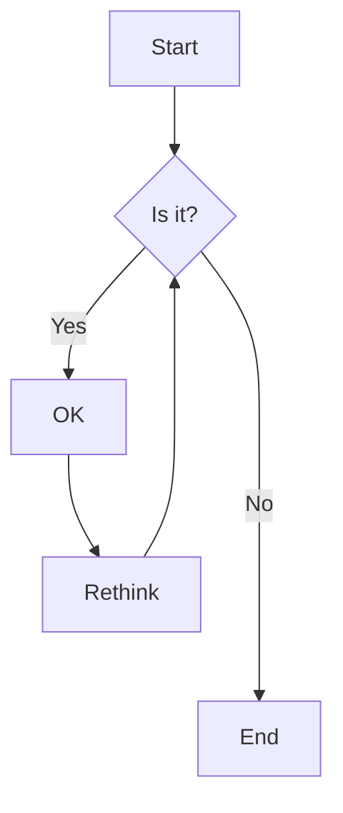
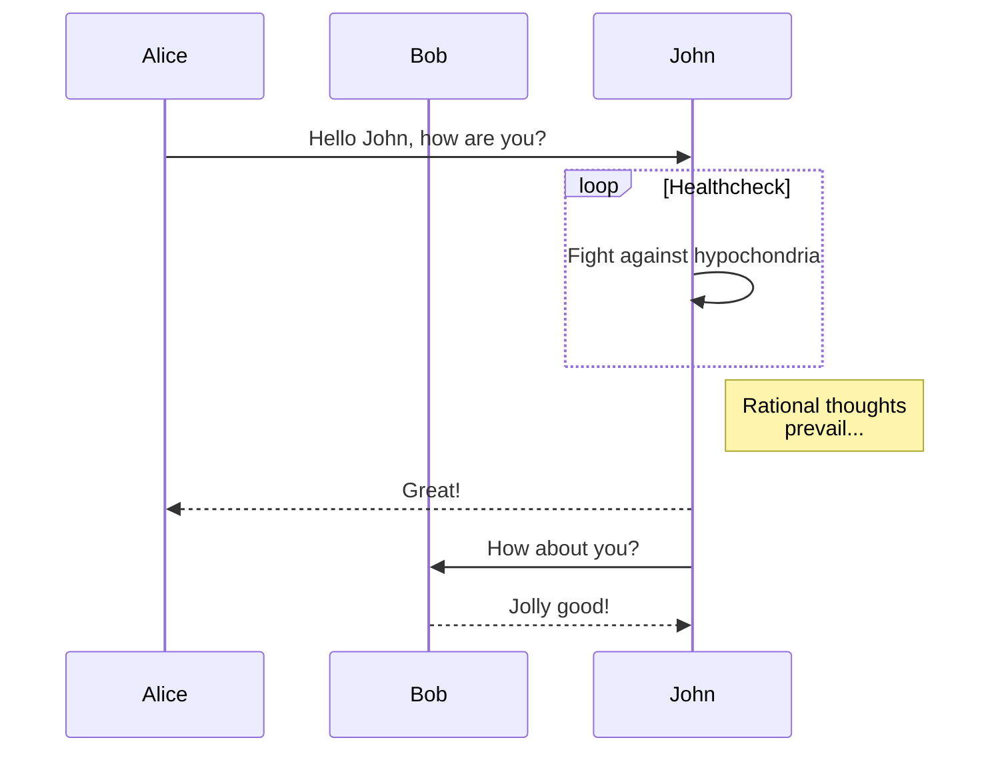

# Advanced Markdown Features

## Mermaid Diagrams

Mermaid allows you to create diagrams and visualizations using text and code.

### Flowchart



### Sequence Diagram



## GeoJSON

GeoJSON is a format for encoding geographic data structures. Here's an example of GeoJSON code (note that this won't render as a map in standard Markdown, but specialized viewers can display it):

```json
{
  "type": "FeatureCollection",
  "features": [
    {
      "type": "Feature",
      "properties": {
        "name": "Eiffel Tower"
      },
      "geometry": {
        "type": "Point",
        "coordinates": [2.294481, 48.858370]
      }
    }
  ]
}
```

## LaTeX Math Equations

Some Markdown renderers support LaTeX for mathematical equations:

Inline equation: $E = mc^2$

Block equation:

$$
\frac{n!}{k!(n-k)!} = \binom{n}{k}
$$

## Task Lists

- [x] Write the press release
- [ ] Update the website
- [ ] Contact the media

## Tables with Alignment

| Left-aligned | Center-aligned | Right-aligned |
|:-------------|:--------------:|--------------:|
| git status   |   git status   |    git status |
| git diff     |    git diff    |      git diff |

## Footnotes

Here's a sentence with a footnote. [^1]

[^1]: This is the footnote.

## Emoji

:rocket: :smile: :books:

(Note: Emoji support varies by platform)

## Syntax Highlighting

```python
def greet(name):
    print(f"Hello, {name}!")

greet("World")
```

## Collapsible Sections

<details>
<summary>Click to expand</summary>

This content is hidden by default but can be expanded by clicking.

</details>

Remember, support for these features can vary depending on the Markdown renderer being used. GitHub supports most of these, but some features like LaTeX equations might require additional extensions or platforms.